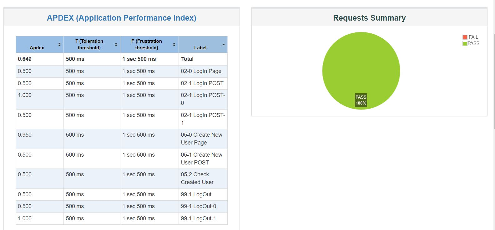
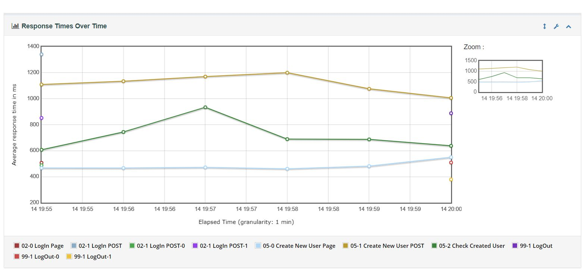
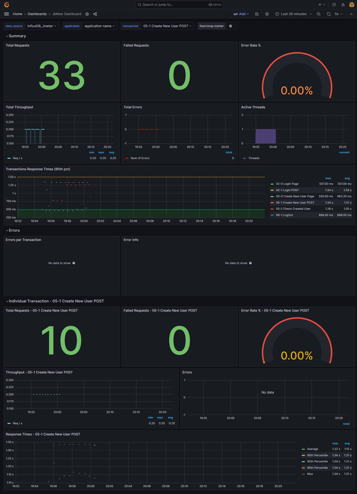
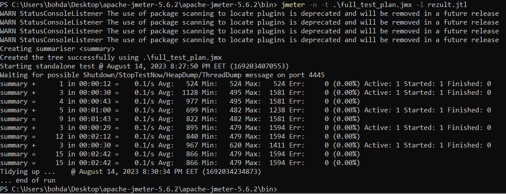
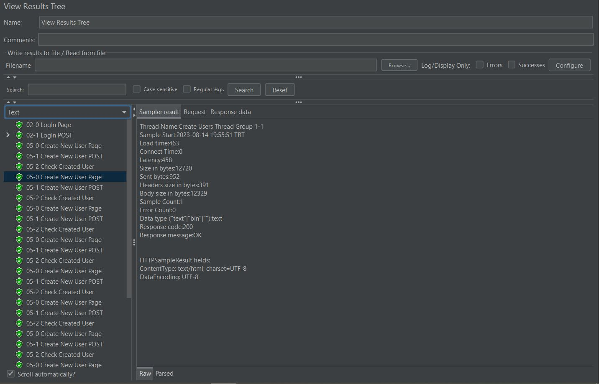
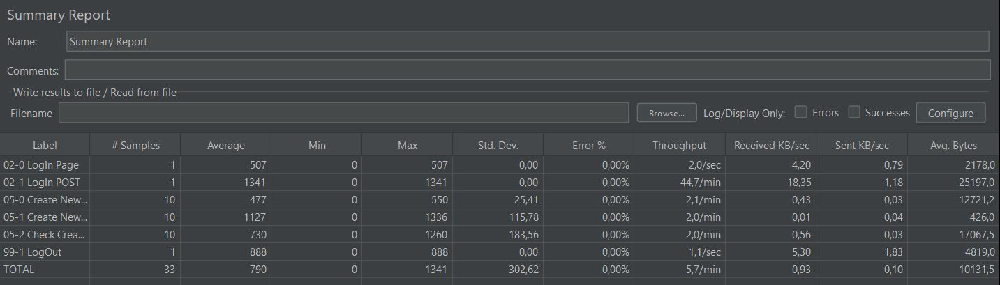
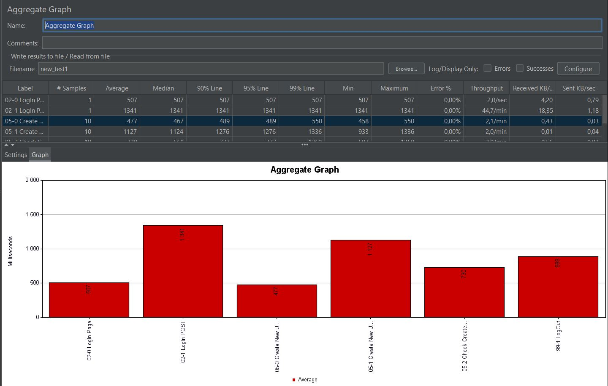

# Web Performance Testing Test Plan using JMeter

This repository contains a JMeter test plan for conducting web Performance testing on a website. The test plan is organized according to the following steps:

## Test Plan Steps

### 1. Creating Users by Admin

- Create users with different roles:
  - Authors
  - Editors

### 2. Creation of Posts and Reading by Authors

- Authors create and post articles:
  - 20% of Authors post 2 articles each
  - 60% of Authors post 1 article each
- Authors read posts:
  - 20% of Authors read posts

### 3. Creation of Posts and Reading by Editors

- Editors create and post articles:
  - 20% of Editors comment 3 comments on random articles
  - 50% of Editors comment 1 comment on random articles
- Editors read posts:
  - 30% of Editors read posts

### 4. Deleting Posts and Comments

- Implement the deletion of posts and associated comments.


### 5. Removal of Authors and Editors

- Admin removes authors and editors.


## Viewing Test Results

You can obtain the test results in different ways:

- **HTML Report**: Run the following command to generate an HTML report:

  ```bash
  jmeter -g <path_to_CSV/JTL_file> -o <path_to_empty_folder>
  ```

  For example:

  ```bash
  jmeter -g C:\Users\user\Desktop\Jmeter\jmeter_project\jmeter_results.jtl -o C:\Users\user\Desktop\Jmeter\jmeter_project\jmeter_results\html_report
  ```
  <p align="center">
  
  </p>

  <p align="center">
  
  </p>

<br>

- **Grafana and InfluxDB**:
  To visualize results in Grafana, create an InfluxDB database and configure a Backend Listener with Grafana's URL and port.


  In Backend Listener implementation select - org.apache.jmeter.visualizers.backend.influxdb.InfluxdbBackendListenerClient
  For example:

  ```
  influxdbUrl - http://127.0.0.1:8086/write?db=jmeter  
  ```
 <p align="center">
  
  </p>

<br>

- **Command Line Reports**:
You can view the reports directly on the command line by running:
- ```jmeter -n -t <path_to_file.jmx> -l <path_to_results.jtl>```

 <p align="center">
  
  </p>


<br>

- **Visual Reports in JMeter**:
You can also view the reports visually within JMeter itself.

<br>

  <p align="center">
  
  </p>

  <p align="center">
  
  </p>


  <p align="center">
  
  </p>

<br>

## Remember to tailor the file paths and URLs to your specific setup.

## For detailed instructions, refer to the official JMeter documentation._
